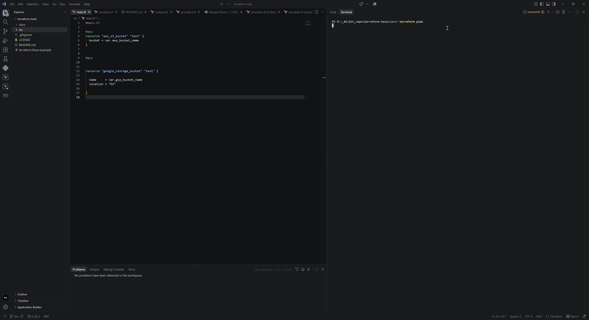

# Terraform
Terraform AWS & GCP and AZURE setup + Check(terraform plan)



```
Terraform used the selected providers to generate the following execution plan. Resource
actions are indicated with the following symbols:
  + create

Terraform will perform the following actions:

  # aws_s3_bucket.test will be created
  + resource "aws_s3_bucket" "test" {
      + acceleration_status         = (known after apply)
      + acl                         = (known after apply)
      + arn                         = (known after apply)
      + bucket                      = "awspaweltftest2026a7x3"
      + bucket_domain_name          = (known after apply)
      + bucket_namespace            = (known after apply)
      + bucket_prefix               = (known after apply)
      + bucket_region               = (known after apply)
      + bucket_regional_domain_name = (known after apply)
      + force_destroy               = false
      + hosted_zone_id              = (known after apply)
      + id                          = (known after apply)
      + object_lock_enabled         = (known after apply)
      + policy                      = (known after apply)
      + region                      = "eu-central-1"
      + request_payer               = (known after apply)
      + tags_all                    = (known after apply)
      + website_domain              = (known after apply)
      + website_endpoint            = (known after apply)

      + cors_rule (known after apply)

      + grant (known after apply)

      + lifecycle_rule (known after apply)

      + logging (known after apply)

      + object_lock_configuration (known after apply)

      + replication_configuration (known after apply)

      + server_side_encryption_configuration (known after apply)

      + versioning (known after apply)

      + website (known after apply)
    }

  # azurerm_resource_group.example will be created
  + resource "azurerm_resource_group" "example" {
      + id       = (known after apply)
      + location = "swedencentral"
      + name     = "rggroup0axf42c"
    }

  # azurerm_storage_account.test will be created
  + resource "azurerm_storage_account" "test" {
      + access_tier                        = (known after apply)
      + account_kind                       = "StorageV2"
      + account_replication_type           = "LRS"
      + account_tier                       = "Standard"
      + allow_nested_items_to_be_public    = true
      + cross_tenant_replication_enabled   = false
      + default_to_oauth_authentication    = false
      + dns_endpoint_type                  = "Standard"
      + https_traffic_only_enabled         = true
      + id                                 = (known after apply)
      + infrastructure_encryption_enabled  = false
      + is_hns_enabled                     = false
      + large_file_share_enabled           = (known after apply)
      + local_user_enabled                 = true
      + location                           = "swedencentral"
      + min_tls_version                    = "TLS1_2"
      + name                               = "stggroup0x43343"
      + nfsv3_enabled                      = false
      + primary_access_key                 = (sensitive value)
      + primary_blob_connection_string     = (sensitive value)
      + primary_blob_endpoint              = (known after apply)
      + primary_blob_host                  = (known after apply)
      + primary_blob_internet_endpoint     = (known after apply)
      + primary_blob_internet_host         = (known after apply)
      + primary_blob_microsoft_endpoint    = (known after apply)
      + primary_blob_microsoft_host        = (known after apply)
      + primary_connection_string          = (sensitive value)
      + primary_dfs_endpoint               = (known after apply)
      + primary_dfs_host                   = (known after apply)
      + primary_dfs_internet_endpoint      = (known after apply)
      + primary_dfs_internet_host          = (known after apply)
      + primary_dfs_microsoft_endpoint     = (known after apply)
      + primary_dfs_microsoft_host         = (known after apply)
      + primary_file_endpoint              = (known after apply)
      + primary_file_host                  = (known after apply)
      + primary_file_internet_endpoint     = (known after apply)
      + primary_file_internet_host         = (known after apply)
      + primary_file_microsoft_endpoint    = (known after apply)
      + primary_file_microsoft_host        = (known after apply)
      + primary_location                   = (known after apply)
      + primary_queue_endpoint             = (known after apply)
      + primary_queue_host                 = (known after apply)
      + primary_queue_microsoft_endpoint   = (known after apply)
      + primary_queue_microsoft_host       = (known after apply)
      + primary_table_endpoint             = (known after apply)
      + primary_table_host                 = (known after apply)
      + primary_table_microsoft_endpoint   = (known after apply)
      + primary_table_microsoft_host       = (known after apply)
      + primary_web_endpoint               = (known after apply)
      + primary_web_host                   = (known after apply)
      + primary_web_internet_endpoint      = (known after apply)
      + primary_web_internet_host          = (known after apply)
      + primary_web_microsoft_endpoint     = (known after apply)
      + primary_web_microsoft_host         = (known after apply)
      + public_network_access_enabled      = true
      + queue_encryption_key_type          = "Service"
      + resource_group_name                = "rggroup0axf42c"
      + secondary_access_key               = (sensitive value)
      + secondary_blob_connection_string   = (sensitive value)
      + secondary_blob_endpoint            = (known after apply)
      + secondary_blob_host                = (known after apply)
      + secondary_blob_internet_endpoint   = (known after apply)
      + secondary_blob_internet_host       = (known after apply)
      + secondary_blob_microsoft_endpoint  = (known after apply)
      + secondary_blob_microsoft_host      = (known after apply)
      + secondary_connection_string        = (sensitive value)
      + secondary_dfs_endpoint             = (known after apply)
      + secondary_dfs_host                 = (known after apply)
      + secondary_dfs_internet_endpoint    = (known after apply)
      + secondary_dfs_internet_host        = (known after apply)
      + secondary_dfs_microsoft_endpoint   = (known after apply)
      + secondary_dfs_microsoft_host       = (known after apply)
      + secondary_file_endpoint            = (known after apply)
      + secondary_file_host                = (known after apply)
      + secondary_file_internet_endpoint   = (known after apply)
      + secondary_file_internet_host       = (known after apply)
      + secondary_file_microsoft_endpoint  = (known after apply)
      + secondary_file_microsoft_host      = (known after apply)
      + secondary_location                 = (known after apply)
      + secondary_queue_endpoint           = (known after apply)
      + secondary_queue_host               = (known after apply)
      + secondary_queue_microsoft_endpoint = (known after apply)
      + secondary_queue_microsoft_host     = (known after apply)
      + secondary_table_endpoint           = (known after apply)
      + secondary_table_host               = (known after apply)
      + secondary_table_microsoft_endpoint = (known after apply)
      + secondary_table_microsoft_host     = (known after apply)
      + secondary_web_endpoint             = (known after apply)
      + secondary_web_host                 = (known after apply)
      + secondary_web_internet_endpoint    = (known after apply)
      + secondary_web_internet_host        = (known after apply)
      + secondary_web_microsoft_endpoint   = (known after apply)
      + secondary_web_microsoft_host       = (known after apply)
      + sftp_enabled                       = false
      + shared_access_key_enabled          = true
      + table_encryption_key_type          = "Service"

      + blob_properties (known after apply)

      + network_rules (known after apply)

      + queue_properties (known after apply)

      + routing (known after apply)

      + share_properties (known after apply)

      + static_website (known after apply)
    }

  # azurerm_storage_container.test will be created
  + resource "azurerm_storage_container" "test" {
      + container_access_type             = "private"
      + default_encryption_scope          = (known after apply)
      + encryption_scope_override_enabled = true
      + has_immutability_policy           = (known after apply)
      + has_legal_hold                    = (known after apply)
      + id                                = (known after apply)
      + metadata                          = (known after apply)
      + name                              = "azrpaweltftest2026a7x3"
      + resource_manager_id               = (known after apply)
      + storage_account_id                = (known after apply)
      + url                               = (known after apply)
    }

  # google_storage_bucket.test will be created
  + resource "google_storage_bucket" "test" {
      + effective_labels            = {
          + "goog-terraform-provisioned" = "true"
        }
      + force_destroy               = false
      + id                          = (known after apply)
      + location                    = "EU"
      + name                        = "gcppaweltftest2026a7x3"
      + project                     = (known after apply)
      + project_number              = (known after apply)
      + public_access_prevention    = (known after apply)
      + rpo                         = (known after apply)
      + self_link                   = (known after apply)
      + storage_class               = "STANDARD"
      + terraform_labels            = {
          + "goog-terraform-provisioned" = "true"
        }
      + time_created                = (known after apply)
      + uniform_bucket_level_access = (known after apply)
      + updated                     = (known after apply)
      + url                         = (known after apply)

      + soft_delete_policy (known after apply)

      + versioning (known after apply)

      + website (known after apply)
    }

Plan: 5 to add, 0 to change, 0 to destroy.

```